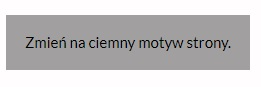
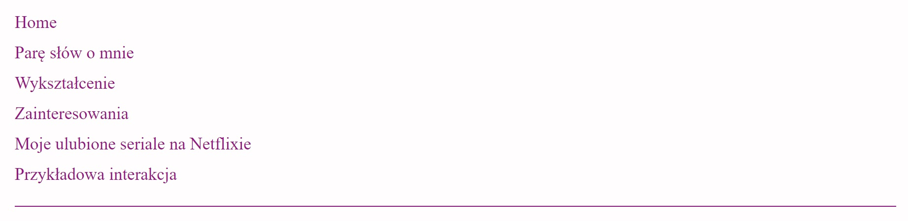
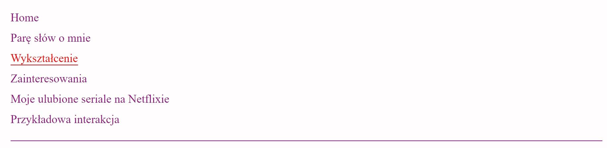
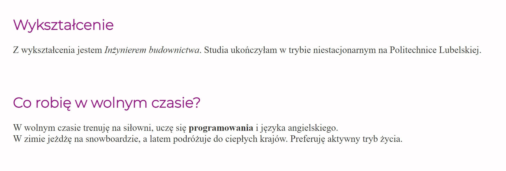

# Website about me - Aleksandra Świtacz

## Website section:
- a few words abot me
- educationgit push

- free time
- my favorite series on Netflix

## Button, that changes bacground of website
1. If You want dark background of website click the button "Zmień na ciemny motyw strony"

2. If You want fair background of website click the button "Zmień na jasny motyw strony"

## Section 
- Section of website:

- When You want to go to any section click this section
- For example You click section "Wykształcenie". 
- You will see this section.

### Demo wersion:
https://switaczaleksandra.github.io/homepage/mojastrona.html

### Have a nice day !
